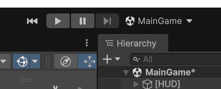

# Unity Scene Toolbar

[](https://unity.com/)
[](LICENSE)

Editor productivity tools for **Unity 6.3+** that live directly in the **Main Toolbar**.

Jump into Play Mode from **Build Settings scene index 0**, or switch between scenes without leaving the toolbar — no more digging through the Project window or File menu mid-iteration.



---

## Features

- **Play from first scene** — one click opens the first enabled scene in Build Settings and enters Play Mode; when you stop, your previous scene is restored
- **Quick scene switcher** — dropdown listing all scenes from Build Settings (falls back to every scene in the project if Build Settings is empty)
- **Unity 6.3 Main Toolbar API** — built on the UI Toolkit `MainToolbarElement` / `MainToolbarButton` / `MainToolbarDropdown` APIs
- **Auto-show on install** — custom toolbar elements are forced visible so you do not have to hunt for them in the toolbar overflow menu

---

## Requirements

| Requirement | Version |
|-------------|---------|
| Unity | **6000.3** or newer (**Unity 6.3+** LTS) |

> **Note:** The extensible Main Toolbar API (`MainToolbarElement`, etc.) was introduced in Unity 6.3. Earlier versions (including Unity 6.0–6.2) are **not supported** and will fail to compile.

This package is **Editor-only**. It does not ship any runtime code and will not affect player builds.

---

## Installation

### Option A — Git URL (recommended)

1. Open your Unity project.
2. Go to **Window → Package Manager**.
3. Click the **+** button in the top-left corner.
4. Choose **Add package from git URL...**
5. Paste:

```
https://github.com/makarGames/Unity-Toolbar-Scene-Selector.git
```

6. Click **Add**.

Git URL: [https://github.com/makarGames/Unity-Toolbar-Scene-Selector.git](https://github.com/makarGames/Unity-Toolbar-Scene-Selector.git)

### Option B — Specific version / tag

```
https://github.com/makarGames/Unity-Toolbar-Scene-Selector.git#v1.0.0
```

### Option C — OpenUPM (optional)

If you publish the package to OpenUPM later:

```
openupm add com.makargames.unity-scene-toolbar
```

---

## Usage

After import, two controls appear on the Unity Main Toolbar:

| Control | What it does |
|---------|----------------|
| **Play From First Scene** | Saves (if needed), opens Build Settings scene index 0, then presses Play. On exit from Play Mode, restores the scene you were editing. |
| **Scene Switcher** | Shows the active scene name. Click to pick another scene from Build Settings. |

If a control is missing, open the Main Toolbar overflow menu (**⋯**) and enable **Unity Scene Toolbar** items.

---

## Package layout

```
com.makargames.unity-scene-toolbar/
├── package.json
├── README.md
├── CHANGELOG.md
├── LICENSE
├── Editor/
│   ├── UnitySceneToolbar.Editor.asmdef
│   ├── FirstScenePlayButton.cs
│   ├── SceneSwitcherToolbar.cs
│   └── MainToolbarVisibility.cs
└── documentation/
    └── demo.gif
```

---

## License

This project is licensed under the [MIT License](LICENSE).
